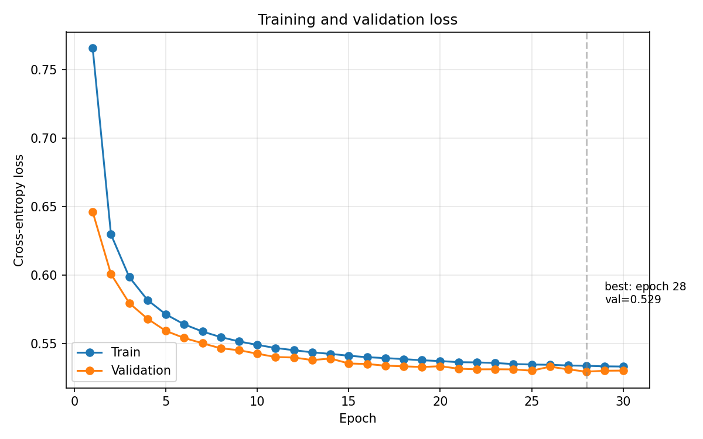
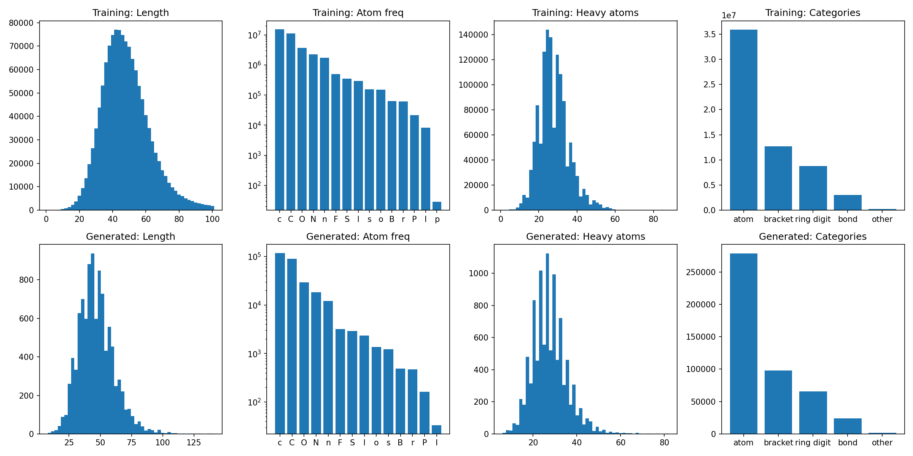

# SMILES generation with a LSTM-RNN

*Hochschule Campus Wien, Machine Learning Assignment, SS26*

https://github.com/sporebyte/mle-ss26

**Sonja Vukotic**

> **Final result**: FCD = 0.3891, Validity = 1.0, Uniqueness = 1.0, Novelty = 0.9983 (T = 1.0)

---

## Summary

*A 2-layer LSTM language model with learned token embeddings was trained on 1.27M canonicalized SMILES from ChEMBL. Atom-wise tokenization yields a 99-token vocabulary; the model has ~3.48M parameters and was trained for 30 epochs. Generation uses temperature-based autoregressive sampling followed by RDKit validity filtering and canonical deduplication. The final submission (T = 1.0) achieves FCD = 0.3891 with validity = 1.0, uniqueness = 1.0, and novelty = 0.9983.*

## Project Layout

```bash
.
├── src/
│   ├── preprocess.py     # Canonicalize and Deduplicate Dataset
│   ├── smiles_model.py   # tokenizer + dataset + LSTM model     
│   ├── train.py          # Training script
│   ├── generate.py       # Generate de novo SMILEs based on training output 
│   ├── plot_history.py   # Plot model performance  
│   ├── stats.py          # Plot input Dataset stats
│   └── analyze.py        # chemistry analysis of generated molecules
├── assets/               # static images for the README
├── notebooks/            # Jupyter Notebooks with the FCD evaluation metrics
├── data/                 # Ignored from repo due to size
│   ├── smiles_clean.txt  # generated by preprocess.py
│   └── smiles_train.txt  # Training dataset of ~1.27M SMILEs
├── outputs/              # outputs folder
├── environment.yml       # Conda env setup
└── README.md
```

## How to run

```bash
# 1. Setup environment
conda env create -f environment.yml
conda activate mle

# 2. Place the provided training data at data/smiles_train.txt, then:
python src/preprocess.py    # writes data/smiles_clean.txt
python src/train.py         # writes outputs/checkpoints/best.pt + outputs/tokenizer.json
python src/generate.py      # writes outputs/submission.txt 
# Optional temp sweeping:
# python src/generate.py --temperature [x] --output outputs/submission_[x].txt

# 3. (Optional) generate plots and analysis
python src/plot_history.py  # outputs/loss_curve.png
python src/stats.py         # outputs/raw_stats.png
python src/analyze.py       # outputs/properties.png + outputs/functional_groups.png
```


## Approach

The model utilized is a multi-layer long short-term memory (LSTM) RNN. 

**Why LSTM**: SMILES strings contain long-range dependencies that vanilla RNNs cannot model (ring closure digits and matched parentheses). LSTMs solve this via a cell state with additive updates and gated information flow, allowing gradients to propagate. A transformer would also work but would add complexity.

**Why 2 layers**: Two stacked LSTM layers are deeper than the simplest baseline (the first layer can potentially encode local syntax, the second can encode larger structural patterns) but shallow enough to train without overfitting concerns and data size issues. 

### Theoretical Background

LSTM RNN is a specialized neural network for sequential data. LSTMs enable backpropagation of the error through time-steps hence helping preserve them through feedback connections that pass on information of as it propagates forward.


*Source: geeksforgeeks.org*

The information which is added or removed to the cell state is regulated by structures called **gates**. These consist of a neural network layer and a pointwise operation.

The **forget gate** is a sigmoid layer that decides which information should be kept or removed from the cell state. It uses the current input and previous hidden state then applies a sigmoid function to generate values between 0 and 1.

The **input gate** is a sigmoid layer that decides which value to update and store in the cell state. A tanh function creates a vector of new candidate values that could be added to the cell state.

The **output gate** is a sigmoid layer that determines which information from the current cell state should be passed as the hidden state (output) at the current time step. 

This **hidden state** is then passed to the next time step and can also be used for generating the output of the network.

### Pre-processing

The input molecules were pre-processed by using the `rdkit` python module that contains a function to select for cannonical SMILE molecules. A short script to remove any duplicates was also utilized.

As all molecules from the dataset were cannonical and had no duplicates, the output dataset was the same one as the dataset received.

### LSTM Architecture and Parameters


|  Setting                       | Description                | Reasoning                           | 
|-------------------------|----------------------------|-------------------------------------|
| Architecture            | 2-layer LSTM; hidden=512; embedding dim=128  | Literature: commonly 1 - 3 Layers.                   |           
| Embedding               | Learned Embedding          | Learned embeddings potentially let the model discover and encode chemical similarity.  |           
| Vocabulary/tokenization | 99 atom-wise tokens        | Atom-in-SMILES replaces generic SMILES tokens with environment-aware atomic tokens, reducing token degeneration and improving chemical translation accuracy. [Source](https://hunterheidenreich.com/notes/chemistry/molecular-representations/notations/atom-in-smiles-tokenization/)                         |          
| Training Data           | 1,27M provided SMILES      | Default Dataset Received in Course           |           
| Epochs                  | 30                         | Literature: 10 - 50 epochs, picked the middle.                                 |           
| Batch size              | 256                        | Mini-batch gradient descent: A middle ground for available GPU utilization.                                 |           
| Learning rate           | 0.001                      | *Kingma and Ba*, **2014**                    |         
| Dropout rate           | 0.2                    | Literature: commonly 0.1 - 0.5.                 |  
| Nr. of Parameters | ~3.48M | Output from `train.py` |

#### Loss curve



## Molecule generation

Generation uses temperature-based sampling. The trained LSTM outputs logits over the vocabulary, which are divided by the temperature parameter T and converted to probabilities via softmax. One token is sampled, fed back as input, and the process repeats until `<EOS>` is emitted (or a maximum length is reached). 

Three post-processing steps are applied to every generated string:

1. **Validity filter**: `RDKit` attempts to parse the SMILES
2. **Canonicalization**: valid molecules are converted to canonical SMILES via `Chem.MolToSmiles`
3. **Uniqueness filter**: duplicates in canonical form are removed

Sampling continues until exactly 10,000 valid unique canonical molecules are collected. The raw validity rate (fraction of attempts that parse) is reported separately for each temperature.

## Evaluation Metrics: Fréchet ChemNet Distance (FCD)

The Fréchet ChemNet Distance (FCD) measures how similar the distribution of generated molecules is to a reference distribution, using a pretrained ChemNet model.

Upon generating 10,000 new molecules, the `/outputs/submission.txt` dataset was evaluated in the `evaluation_notebook.ipynb` and had the following results:

| Temperature | t 0.8 | **t 1.0** | t 1.2
|-|-|-|-|
| FCD | 1.1485 | **0.3891** | 1.0042 |          
| Validity | 1.0 | **1.0** | 1.0     |    
| Uniqueness | 1.0 | **1.0** | 1.0  |       
| Novelty | 0 | **0.9983** | 0 |   

## Visualizations and insights




### Lipinski properties

Lipinski's rule of five, also known as Pfizer's rule of five or simply the rule of five (RO5), is a rule of thumb to evaluate druglikeness or determine if a chemical compound with a certain pharmacological or biological activity has chemical properties and physical properties that would likely make it an orally active drug in humans. The rule was formulated by Christopher A. Lipinski in 1997, based on the observation that most orally administered drugs are relatively small and moderately lipophilic molecules. [From Wikipedia]

For this purpose the python package `rdkit.Chem` contains a `Lipinski` module which is imported into `src/analyze.py` to output the properties of the generated molecules and compare them to the training set (normalized values).


## Limitations and future work

A few additional approaches could be explored to improve the pipeline:

- **Hyperparameter optimization**: A search via Bayesian optimization of hyperparameters could improvements but requires additional time

- **Bidirectional generation** Grisoni et al. 2020 argue that the  left-to-right reading direction is arbitrary for SMILES, which has no natural  beginning or end. Their bidirectional architecture generates outward from a  randomly selected starting atom in both directions simultaneously 

- **Evaluation novelty artifact** As noted in the Evaluation section, two of the  three temperature runs report novelty = 0, which should be explored but is not included in this repo

- **Stricter post-processing**: Beyond validity and uniqueness, generated  molecules could be filtered for drug-likeness, synthetic accessibility or 
unusual atom-types

## Resources

- Geeks for Geeks. "Deep Learning – Introduction to Long Short-Term Memory."  https://www.geeksforgeeks.org/deep-learning/deep-learning-introduction-to-long-short-term-memory/
- Heidenreich, H. "Atom-in-SMILES Tokenization." https://hunterheidenreich.com/notes/chemistry/molecular-representations/notations/atom-in-smiles-tokenization/
- Hiya31. "A Guide to LSTM Hyperparameter Tuning for Optimal Model Training." Medium, 2023. https://hiya31.medium.com/a-guide-to-lstm-hyperparameter-tuning-for-optimal-model-training-064f5c7f099d
- "10 Hyperparameters to Keep an Eye on for Your LSTM Model and Other Tips." Medium, Geek Culture. https://medium.com/geekculture/10-hyperparameters-to-keep-an-eye-on-for-your-lstm-model-and-other-tips-f0ff5b63fcd4
- PyTorch. "torch.nn.LSTM — PyTorch 2.12 Documentation." https://docs.pytorch.org/docs/2.12/generated/torch.nn.LSTM.html
- StatQuest with Josh Starmer. "Long Short-Term Memory (LSTM), Clearly Explained" [Video]. YouTube. https://www.youtube.com/watch?v=6niqTuYFZLQ
- "RNN-based molecular property prediction" https://projects.volkamerlab.org/teachopencadd/talktorials/T034_recurrent_neural_networks.html 
- ***Bidirectional Molecule Generation with Recurrent Neural Networks***; F Grisoni, M Moret, R Lingwood, and G Schneider (2020); *DOI: 10.1021/acs.jcim.9b00943*
- ***Molecular Transformer: A Model for Uncertainty-Calibrated Chemical Reaction Prediction***; P Schwaller, T Laino, T Gaudin, P Bolgar, C A. Hunter, C Bekas, and A A. Lee (2019); *DOI: 10.1021/acscentsci.9b00576* 
- ***Molecular Generation with Recurrent Neural Networks (RNNs)***; J Bjerrum and R Threlfall (2017); *ArXiv abs/1705.04612*
- ***A method for stochastic optimization.*** Kingma, D. P., & Ba, J. (2014); *arXiv:1412.6980.*


## AI-use disclaimer

Claude: Opus 4.7 

Uses:
- code proofreading and bug fixes
- theoretical understanding of ML
- suggestions for project structure
- pseudocode generation 
- report formatting

**All design decisions and final code are reviewed and adapted by the author.**
